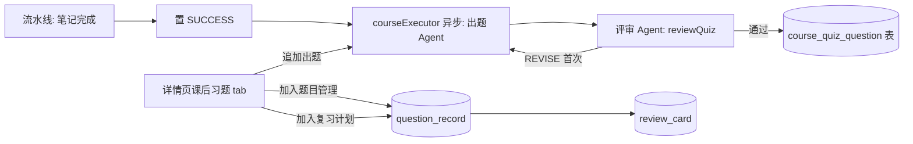

## 产品概述

课后习题升级为课程级产物：与 AI 笔记并列的流水线产出。由「出题 Agent」（QuizAgent，基于课程内容文档与转写出题）+「评审 Agent」（练习评审角色把关）组成双 Agent 链路，视频处理完成后自动生成；详情页新增「课后习题」tab 供练习、追加与沉淀。

## 核心功能

- 流水线末端自动出题：AI 笔记完成后由出题 Agent 生成 5 道课后习题，练习评审 Agent 评审（可解性/难度分布/依据标注），不通过带意见重出 ≤1 次
- 追加出题：用户觉得不够练可「再出几道」，prompt 携带已有题目避免重复
- 详情页「课后习题」tab：下分题目与答案两个部分，题目区展示题面与依据时间戳（可点击跳回视频），答案区默认收起、支持单题展开或全部显示
- 沉淀入口：单题「加入题目管理」（入 question_record）与「加入复习计划」（入题目管理 + 复习队列）
- 对话委派出题链路保留不变

## 技术方案

### 现状依据

- 出题核心：`QuizAgentService`（QUIZ_AGENT_PROMPT 出题 + ContentReviewService.reviewQuiz 评审 + 落 question_record），纯函数 parseQuestions/buildQuizUserPrompt 可复用
- 流水线：`CoursePipelineService` understandAndRenderNote 后置 SUCCESS；courseExecutor 线程池；AgentEventPushService 推送
- 详情页：CourseDetail.vue 三 tab（AI 笔记/转写对照/AI 问答）+ 时间戳胶囊 seekTo + 重新生成轮询模式
- 复习队列：POST /review/cards（cardType='question' 需 question_record refId）

### 架构设计

### 实施要点

1. **新表** `course_quiz_question`（course_id/user_id/question_text/answer/analysis/source_sec/sort）+ course 表加 `quiz_status` 列（NULL/GENERATING/DONE/FAILED，幂等碎片 SQL，改表三步）
2. **QuizAgentService 重构**：抽出无落库的 `generateQuestions(course, document, points, transcriptExcerpt, count, profile, existingQuestions, reviewIssues)` 核心（existingQuestions 注入 prompt 防重复）；对话链路 `generate` 改为调核心 + 落 question_record
3. **CourseQuizService**（新）：`generateForCourse(course)`（出题+评审+落新表，quiz_status 状态机）、`append(userId, courseId, count)`（追加）、`addToQuestionRecord`（复制入 question_record 返回 id）
4. **流水线接入**：置 SUCCESS 后 courseExecutor 异步 `generateForCourse`（失败置 FAILED 不影响课程状态）
5. **API**：detail 返回 quizQuestions；`POST /courses/{id}/quiz`（追加出题，异步轮询）；`POST /courses/{id}/quiz/{qid}/save`（body.action = QUESTION_MANAGER | REVIEW_PLAN，后者先入题目管理再 addReviewCard）
6. **前端 CourseDetail.vue**：tab 加「课后习题」；生成中态（quiz_status=GENERATING 轮询）；题目区（序号+题面+依据胶囊 seekTo）/答案区（每题展开 + 顶部全部显示开关）；底部「再出 5 道」；每题两个沉淀按钮；stage 文案无需新增（习题生成不占流水线 stage）
7. 单测：generateQuestions 防重复注入、CourseQuizService 落库/状态机（mock）；mvn test 全量 + npm build；真实冒烟用课程 24 重新生成验证习题产出与追加

### 性能与边界

- 出题异步不阻塞课程 SUCCESS；单次生成 = 1 次出题 LLM + ≤2 次评审 LLM
- 习题与用户错题本（question_record）解耦，显式操作才复制过去，向后兼容

## 设计说明

课程详情页新增「课后习题」tab，沿用现有卡片体系（bg-surface/shadow-card/rounded-xl 语义令牌）：

- **生成中态**：spinner + 「出题 Agent 正在根据课程内容出题…」
- **题目区**：有序列表，每题卡内展示题面（Markdown 渲染）+ 依据时间戳胶囊（primary 色，点击 seekTo 跳视频）
- **答案区**：默认折叠，每题「查看答案」展开参考答案与解析（analysis 含依据时间戳）；顶部「显示全部答案」开关一键切换
- **操作区**：每题底部「加入题目管理」「加入复习计划」次要按钮（已加入置灰）；tab 底部「再出 5 道」主按钮（生成中转圈）
- 视觉与 AI 笔记 tab 一致，重点/易错标签沿用 amber/red 色系