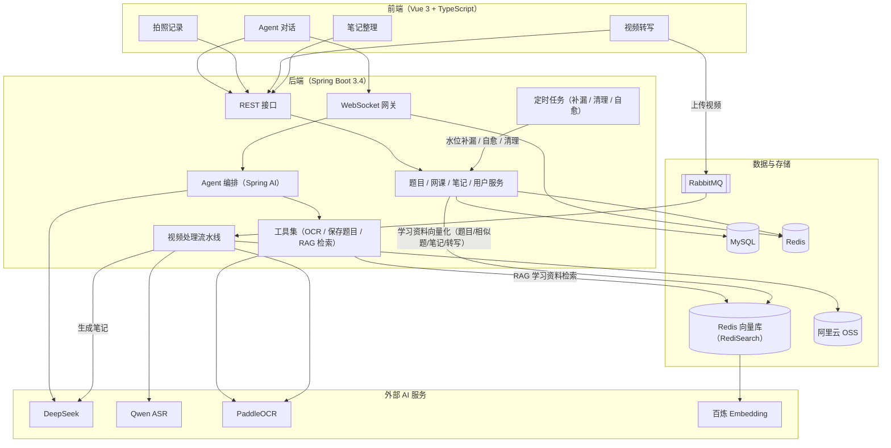

# 学迹 Agent

AI 个人学习工作台：学习资产（网课 / 题目 / 笔记）+ 知识点页 + Human-in-the-loop 的 Agent 对话。记录你与知识发生过什么，并把它们连成网。

   

**学迹**把个人学习中最容易散失的三类资产——看过的**网课视频**、拍过的**题目**、随手记的**笔记**——统一收纳进同一个工作台，并让 AI 参与其中：

- **网课转写成结构化笔记**：上传视频后由流水线自动完成语音转写、关键帧识别与笔记生成，笔记中的时间戳可以点击跳回原片核对；
- **拍题即得解答**：拍照上传后 OCR 识别题目，AI 整理解答与错因，确认后归档进拍照记录；
- **相似题从你的真实学情里出**：保存过的题目自动向量化入库，AI 出练习题前先检索你真实做过的题与错因，不虚构没学过的内容；
- **知识连成网**：每个知识点是一页笔记，页与页、页与网课、页与题目之间用「知识联系」互相挂链，复习时顺藤摸瓜；
- **Human-in-the-loop 的 Agent**：对话贯穿全部学习资产，涉及保存、修改等持久化操作时必须经用户确认才会执行。

## 界面预览

| Agent 对话 | 笔记整理 |
| --- | --- |
|  |  |
| **网课记录** | **网课详情 · AI 笔记** |
|  |  |

## 技术栈

- **前端**：Vue 3 + TypeScript + Tailwind CSS（Vite 构建，桌面 / 移动端响应式）
- **后端**：Spring Boot 3.4 + MyBatis-Plus + MySQL 8 + Redis + RabbitMQ + Sa-Token
- **AI**：Spring AI 接 DeepSeek（对话与笔记生成）；语音转写 Qwen-Audio ASR（阿里云百炼）；OCR 百度 PaddleOCR（AI Studio 异步任务）；向量检索 Redis（RediSearch）+ 百炼 text-embedding；图片存储阿里云 OSS

## 功能现状

### 会话
- 多轮流式对话（WebSocket，Redis 记忆滑窗）、会话历史与标题、对话图片上传（OSS）
- 拍照解题：图片 OCR → 文本格式化 → AI 整理解答 → 确认后保存进拍照记录；OCR 轮询在弹性线程执行（上限可配置，默认 45s），超时降级提示，不阻塞请求
- 会话记忆兜底：Redis 缓存缺失（清空 / 逐出）时自动从 MySQL 事实源重建热上下文，任何时刻清空 Redis 功能不变
- 消息级操作条（复制可用）、解答回复带「保存到拍照记录」引导
- 会话治理：单会话 100 轮次上限，每日定时清理 30 天未活跃会话（连带消息与 Redis 记忆）

### RAG 检索（相似题 / 学习资料）
- 统一向量化入库：拍照题目（q: 前缀）、AI 相似题（sq: 前缀）、笔记（超长按小节切块）、网课转写分段（带课程名与时间戳元数据）
- `rag_search` 工具按 userId 硬过滤（只召回本人数据）+ 可选学科过滤，召回结果带【题目 / 笔记 / 网课】来源标记；向量库为 Redis（RediSearch HNSW，1024 维）
- 定时补漏任务：启动全量回填 + 每 3 小时按水位增量重摄，摄取失败最终一致
- AI 生成相似题 / 练习题前必须先检索真实学习片段并基于召回内容命题，召回为空时如实告知

### 拍照记录
- 题目分页列表（每页 10 条）：拍照题目与 AI 相似题合并展示，相似题带「AI 生成」标记
- 详情、编辑（题目 / 解答 / 我的作答 / 笔记；相似题编辑题干 / 解答 / 解析）、逻辑删除（双表按来源分派）
- 按日期 + 学科筛选（学科由 AI 保存题目时自动分类，可手动修改）
- 题目详情页一键「生成相似题」：选择在当前会话继续或创建新会话，原题上下文自动注入对话，确认保存后入相似题表
- 保存内容由模型先整理（清洗「说明：…补全为…」等元叙述），imageUrl 由服务端确定性获取
- 学科选项：数学 / 语文 / 英语 / 物理 / 化学 / 生物 / 历史 / 地理 / 政治 / 计算机 / 其他

### 视频转写
- 上传视频 → RabbitMQ 流水线：FFmpeg 抽音频与关键帧 → ASR 分片转写（长音频 280s 分片 + 句级时间戳合并）→ 批量帧 OCR → LLM 生成 AI 笔记入库
- AI 笔记固定结构：课程概览（一句话概括 + 主要内容）→ 章节时间线（表格，时间戳可点击跳转视频）→ 知识点 → 总结
- 列表（标题搜索 / 状态 / 日期 / 学科筛选）、详情三标签（AI 笔记 / 转写对照 / 关键帧识别）、在线编辑标题与学科
- 视频在线播放，笔记与转写中的时间戳点击即跳转对应片段
- 网课删除：列表页批量管理模式（勾选 / 全选），连带清理 AI 笔记、知识联系、RAG 向量与 OSS 文件；处理中的网课禁止删除
- 处理超时自愈：定时把卡在 PROCESSING 超过 60 分钟的网课置为失败，允许手动重试

### 笔记整理
- OneNote 式分层树：自定义分组最多 5 层，新建 / 重命名 / 移动 / 删除（分组删除递归级联，带确认警告）
- 双轨编辑：手动笔记富文本、AI 笔记 Markdown 源码（含工具按钮 / 预览 / 编辑与预览滚动同步）；点击空白区域即保存
- 知识联系右侧边栏：卡片展示关联的网课 / 题目 / 笔记及一句关联说明；弹窗聚合搜索挂链；点击卡片跳转（网课带时间戳、题目自动弹出详情）
- 页面切换后保留上次打开的笔记与树状态（KeepAlive）

### 个人页面
- 设置入口（左下角图标栏弹层 / Ctrl+,）打开个人设置弹窗
- 资料：头像上传（OSS）、昵称、邮箱与个人简介（选填）
- 偏好：浅色 / 深色主题一键切换（令牌级全局翻转，默认浅色）、任务完成 / 失败通知开关（右上角 Toast 轮询提醒，可关）
- 账号：修改密码（校验原密码）、退出登录、注销账号（密码 + 确认词双确认，逻辑删除并拦截登录）

## 总体架构



- **对话链路**：Agent 对话经 WebSocket 网关进入 Agent 编排（Spring AI 流式调用 DeepSeek），带图消息先经 PaddleOCR 识别（弹性线程执行）再拼入上下文，涉及持久化的操作由工具集执行并需用户确认；会话记忆存于 Redis（缺失时自动从 MySQL 重建），消息双写 MySQL。
- **RAG 链路**：拍照题目、AI 相似题、笔记（按小节切块）与网课转写分段统一向量化入库（百炼 text-embedding，userId / 学科 / 类型作为过滤与来源元数据）；生成相似题或回答学习状态类问题时 `rag_search` 按用户身份召回真实学习片段；定时任务按水位补漏，保证向量库与事实源最终一致。
- **视频转写链路**：上传的视频经 RabbitMQ 进入处理流水线——FFmpeg 抽取音频与关键帧、Qwen ASR 分片转写、PaddleOCR 批量识别帧文字，最后由 LLM 生成结构化 AI 笔记；视频与帧图存于阿里云 OSS。

## 目录结构

```text
LJ-Agent/
├── README.md / 学迹PRD.md / agent.md   # 项目说明 / 产品需求 / 开发规范与交接状态
├── springboot/                          # 后端（Spring Boot 3.4，端口 9090）
│   └── src/main/java/com/xueji/agent/
│       ├── ai/        # Spring AI 编排：对话、笔记生成、RAG 统一摄取、工具（OCR/ASR/保存题目/RAG 检索）
│       ├── controller/# REST 接口（auth / users / conversations / question / courses / notes / file）
│       ├── service/   # 业务逻辑（对话、题目双表、网课流水线、笔记树与知识联系、用户）
│       ├── task/      # 定时任务（RAG 补漏 / 会话清理 / 网课处理超时自愈）
│       ├── mq/        # RabbitMQ 消费者（网课流水线入口）
│       ├── ws/        # WebSocket 处理器与握手鉴权
│       ├── config/    # 线程池 / MQ / Sa-Token / CORS / Spring AI / WebSocket 配置
│       ├── domain/    # entity / dto / vo / enums
│       ├── mapper/    # MyBatis-Plus Mapper
│       ├── utils/     # OSS 上传与清理、Redis 工具
│       └── common/ exception/  # 统一响应 / 键名与归属校验收口 / 业务异常
└── web/                                 # 前端（Vue 3 + Vite，端口 5173）
    └── src/
        ├── api/     # 后端接口封装（统一 Result 解包与 token 注入）
        ├── stores/  # Pinia：agent（对话）/ auth / user（资料与主题）/ toast（轻提示与任务通知）/ ui
        ├── components/ # ProfileModal（个人页面）/ ToastHost / 布局与笔记组件
        ├── ws/      # WebSocket 封装（指数退避自动重连 + 离线暂存冲刷）
        ├── utils/   # Markdown + KaTeX 渲染（DOMPurify 消毒）
        └── views/   # Agent / History / Questions / Courses / CourseDetail / Notes / Login / Register
```

## 测试

```bash
cd springboot && mvn test   # 114 个单元测试（13 个测试类，含 FFmpeg 真实调用用例）
cd web && npm run build     # 前端类型检查与构建
node web/test-profile-smoke.mjs        # 个人页面端到端冒烟（需后端已启动，一次性账号跑全生命周期）
node web/test-ws.mjs                   # WebSocket 对话冒烟
```
