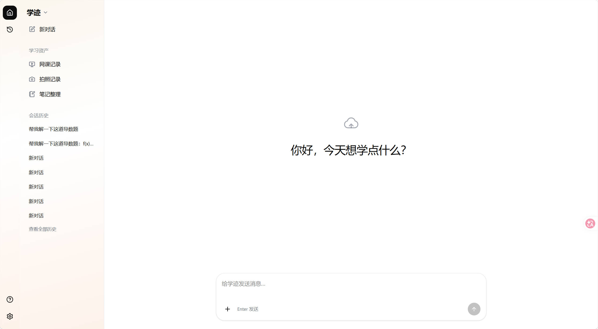
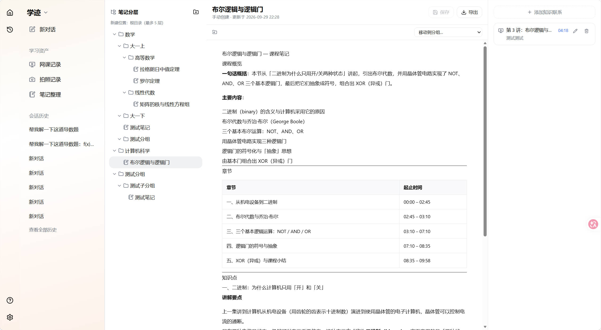
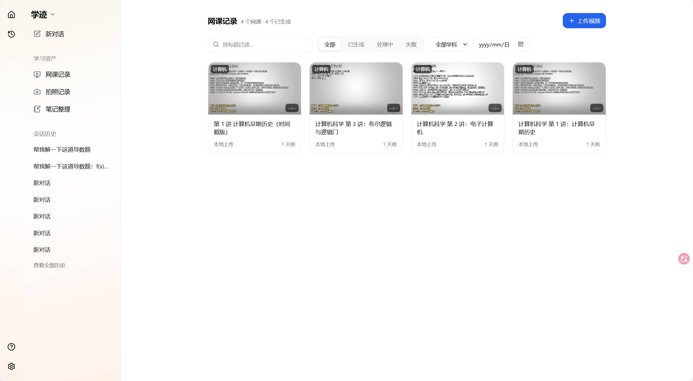
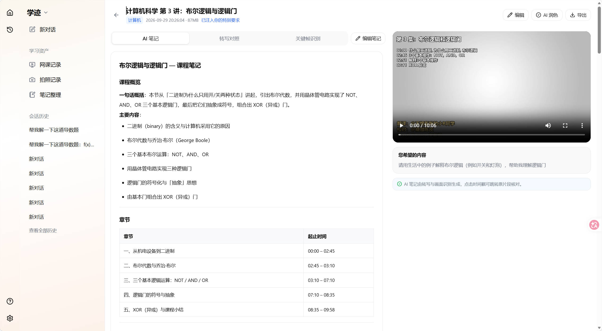
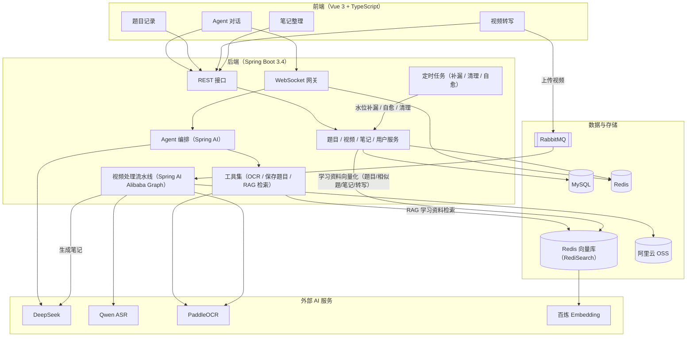

# LearnTrace（学迹）

AI 个人学习工作台：学习资产（视频 / 题目 / 笔记）+ 知识点页 + Human-in-the-loop 的 Agent 对话。记录你与知识发生过什么，并把它们连成网。

   

**LearnTrace** 把个人学习中最容易散失的三类资产——看过的**视频**、拍过的**题目**、随手记的**笔记**——统一收纳进同一个工作台，围绕三条核心链路让 AI 参与其中：

- **视频转写（核心链路）**：采用 Human-in-the-loop 循环，支持多轮对话与视频转写——上传视频先由意图确认 Agent 定制提问，确认后自动完成语音转写、关键帧识别，把视频转写成**结构化 AI 笔记 + 课后习题**，语音内容也可存为笔记。转写链路内置多角色评审：
  - 笔记角色：内容理解 Agent 产出章节与知识点 → **内容设计评审**（前置门禁，不合格打回重写）→ 笔记渲染 → **讲解评审** 与 **练习适用性评审** 并行（不合格定向重生成）；
  - 出题角色：笔记与画像就绪后启动 **出题 Agent**（规划知识点与题量）→ **写题 Agent**（逐题实现）→ **审题 Agent**（程序化校验 + LLM 评审，不合格反馈回写）。
  - 每日生成今日简报，提示用户的学习状态并跟随会话按「会话 × 日期」归属。
- **管理模块**：
  - 视频管理：列表筛选、在线播放、时间戳跳转原片、批量删除（连带清理关联数据）；
  - 题目管理：拍照题目 OCR 解答后归档、AI 相似题基于向量检索真实学情生成（不虚构没学过的内容）、一键从题目生成相似题；
  - 笔记管理：OneNote 式分层树 + 知识联系互相挂链成网；视频 AI 笔记默认不进入笔记管理，用户在对话中明确要求保存时才由 Agent 工具写入。
- **RAG 检索链路**：题目、相似题、笔记与转写分段统一向量化入库（按用户隔离），AI 命题、讲解与简报全部基于真实学习数据，不编造统计里没有的结论。

## 界面预览

| Agent 对话 | 笔记整理 |
| --- | --- |
|  |  |
| **视频记录** | **视频详情 · AI 笔记** |
|  |  |

## 技术栈

- **前端**：Vue 3 + TypeScript + Pinia + Tailwind CSS（Vite 构建，桌面 / 移动端响应式；WebSocket 流式对话）
- **后端**：Spring Boot 3.4 + MyBatis-Plus + MySQL 8 + Redis + RabbitMQ + Sa-Token；视频处理 FFmpeg（抽音频 / 关键帧）
- **AI**：Spring AI 接 DeepSeek（对话、笔记生成、意图确认、每日简报）；Spring AI Alibaba Graph（视频流水线编排）；语音转写 Qwen-Audio ASR（阿里云百炼）；OCR 百度 PaddleOCR（AI Studio 异步任务）；向量检索 Redis（RediSearch）+ 百炼 text-embedding；图片 / 视频存储阿里云 OSS

## 总体架构



- **对话链路**：Agent 对话经 WebSocket 网关进入 Agent 编排（Spring AI 流式调用 DeepSeek），持久化操作由工具集执行并需用户确认；会话记忆存于 Redis（缺失时自动从 MySQL 重建），消息双写 MySQL。
- **RAG 链路**：题目、相似题、笔记与视频转写分段统一向量化入库；生成相似题或回答学习状态类问题时按用户身份召回真实学习片段，定时任务保证向量库与事实源最终一致。
- **视频转写链路**：上传的视频经 RabbitMQ 进入处理流水线（Spring AI Alibaba Graph 编排）——抽取音频与关键帧、分片转写、批量识别帧文字，最后由 LLM 生成结构化 AI 笔记；视频与帧图存于阿里云 OSS。

## 目录结构

```text
LJ-Agent/
├── README.md / 学迹PRD.md / agent.md   # 项目说明 / 产品需求 / 开发规范与交接状态
├── docs/                                # 项目地图 / 模块文档 / backlog
├── springboot/                          # 后端（Spring Boot 3.4，端口 9090）
│   └── src/main/java/com/xueji/agent/
│       ├── ai/        # Spring AI 编排：对话、意图确认、笔记生成、RAG 统一摄取、工具集
│       ├── controller/# REST 接口（auth / users / conversations / question / courses / notes / home / briefing / file）
│       ├── service/   # 业务逻辑（对话、题目、视频流水线、笔记树与知识联系、用户）
│       ├── task/      # 定时任务（RAG 补漏 / 会话清理 / 视频处理超时自愈）
│       ├── mq/        # RabbitMQ 消费者（视频流水线入口）
│       ├── ws/        # WebSocket 处理器与握手鉴权
│       ├── config/    # 线程池 / MQ / Sa-Token / CORS / Spring AI / WebSocket 配置
│       ├── domain/    # entity / dto / vo / enums
│       ├── mapper/    # MyBatis-Plus Mapper
│       ├── utils/     # OSS 上传与清理、Redis 工具
│       └── common/ exception/  # 统一响应 / 键名与归属校验收口 / 业务异常
└── web/                                 # 前端（Vue 3 + Vite，端口 5173）
    └── src/
        ├── api/     # 后端接口封装（统一 Result 解包与 token 注入）
        ├── stores/  # Pinia：agent（对话与简报）/ auth / user / toast / ui
        ├── components/ # ProfileModal / ToastHost / chat（对话面板 / 意图卡片 / 模型切换）/ 布局与笔记组件
        ├── ws/      # WebSocket 封装（指数退避自动重连 + 离线暂存冲刷）
        ├── utils/   # Markdown + KaTeX 渲染（DOMPurify 消毒）、导出工具
        └── views/   # Home（学习仪表盘）/ Agent / History / Questions / Courses / CourseDetail / Notes / Review / Quiz / Login / Register
```

## 测试

```bash
cd springboot && mvn test   # 265 个单元测试（41 个测试类，含 FFmpeg 真实调用用例）
cd web && npm run build     # 前端类型检查（vue-tsc）与构建
node web/test-profile-smoke.mjs        # 个人页面端到端冒烟（需后端已启动）
node web/test-ws.mjs                   # WebSocket 对话冒烟
node web/test-review-smoke.mjs         # 复习系统全流程冒烟
node web/test-briefing-smoke.mjs       # 每日简报冒烟（真实 LLM）
node web/test-model-smoke.mjs          # 模型管理冒烟
```
